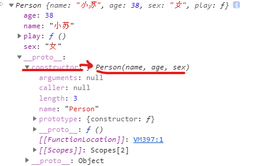
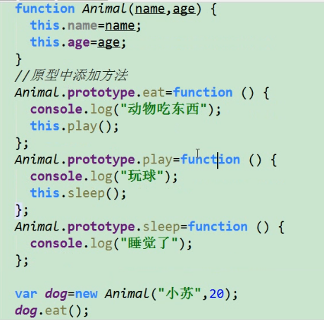
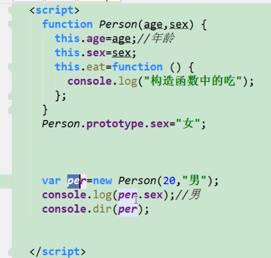
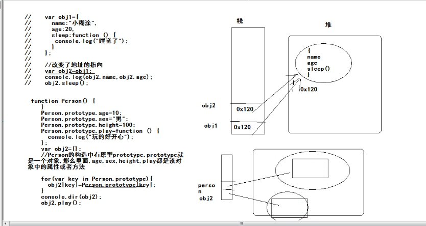

# JavaScript 高级

## 第一天

### JS的组成

+ Ecmascript

  > 描述了该语言的语法和基本对象

+ DOM

  > 描述了处理网页内容的方法和接口

+ BOM

  > 描述了与浏览器进行交互的方法和接口

### 创建对象的三个方法

#### 字面量的方式

```javascript
let per1 = {
	name: '卡卡西',
    age: 20,
    sex: '男',
    eat: function () {
        console.log("吃臭豆腐")
    },
    readBook: function () {
        console.log("琴儿天堂")
    }
}

```

#### 调用系统的构造函数

```javascript
let per2 = new Object()
per2.name = "大蛇丸"
per2.age = 30
......

```

#### 自定义构造函数

```javascript
function Person (name, age, sex) {
    this.name = name
    this.age = age
    this.sex = sex
    this.play = function () {
        console.log("天天打游戏")
    }
    // 因为new 这个关键字 进行了函数的构造调用
    var per = new Person('周田', 18, '女')
    /*
    	1、开辟空间存储对象
    	2、把this设置为当前“通过new创建对象后返回的对象”
    	3、设置属性和方法的值
    	4、把this对象返回
    **/
}
```

#### 工厂模式

```javascript
function createObjectFn (name, age) {
    let obj = new Object()
    obj.name = name
    obj.age = age
    obj.sayHi = function () {
        console.log('你好')
    }
    return obj
}

let per1 = createObjectFn('赵思', 22)
```

### 构造函数和实列对象之间的关系

```javascript
function Person (name, age, sex) {
    this.name = name
    this.age = age
    this.sex = sex
    this.play = function () {
        console.log("天天打游戏")
    }
}

let per1 = new Person('小苏', 38, '女')

consoloe.log(per.constructor === Person)  //true
consoloe.log(per.__proto__.constructor === Person)  // true
Person.protype.constructor === Person // true
```

+ 实例对象时通过构造函数来创建的

+ 实例对象的构造器指向其构造函数

  

#### 通过原型对一个构造函数创建出来的对象进行数据共享

```javascript
function Person(name, age) {
    this.name = name
    this.age = age
}
Person.prototype.eat = function () {
    console.log('在构造函数原型上的方法，其创建出来的对象共享')
}
let p1 = new Person('hjj', 20)
let p2 = new Pserson('jjj', 30)

console.log(p1.eat === p2.eat)   // true
```

#### 构造函数中的this指向问题

```javascript
function Person(name, age) {
    this.name = name
    this.age = age
}

Pserson.prototype.init = function () {
    // 此this是实列对象
    // 打印出来的this没有prototype 只有_proto_ 不是构造函数
    console.log(this)
}

let p1 = new Pserson('dwd', 20)
p1.init()
```

#### 原型对象中的方法是可以相互调用的




#### 原型链中的属性查找规则



```javascript
<script>
function Person(age, sex) {
    this,age=age;
    this sex=sex:
    this eat= function () {
      conso1e.1og("构造函数中的吃")
    }
};
person. prototype. sex="女";
var per=new Person(20, "51");
console.log (per sex); //1
console.dir(per);  // 打印出来的性别是男 说明 先从实列对象中查找属性
</script>
```

**稍微总结**

构造函数可以实例化一个对象

构造函数中有一个属性`prototype`这是构造函数的原型对象

`prototype`对象中有一个属性是`constructor`构造器，这个构造器指向的就是自己所在的原型对象所在的构造函数

构造函数实列化出来的**实列对象**的属性`__proto__（非标准属性，浏览器使用）`指向的是该构造函数的原型对象

## 第二天

### 函数也是对象

```javascript
function Person (age) {
    this.age = age
}
// 函数也可以通过.的方式 可以说明其也是对象
Person.prototype.sayHi = function () {
    
}
```

## 第三天

**实例对象和原型对象之间的关系是通过__proto__原型来联系起来的，这个关系，就是原型链**

### 原型的指向是否可以改变

 ### 通过改变原型链来实现继承

> 改变原型对象的时候直接初始化了属性 ，继承过来的属性都是一样的
>
> 可以通过后续obj.name = xxx 来改变属性

```javascript
function Person(name, age, sex) {
    this.name = name
    this.sex = sex
    this.age = age
}
Person.prototype.eat = function () {
    console.log('人可以吃东西')
}
Person.protype.sleep = function () {
    console.log('睡觉')
}
Person.prototype.play = function () {
    console.log('玩玩')
}

// 学生构造函数
function Student(score) {
    this.score = score
}
// 改变学生原型的指向
/*
	缺陷在于：
	1.改变原型指向的同时实现继承，直接初始化了属性，继承过来的属性值都是一样的
*/
Student.prototype = new Person('小名', 10, '男')
Student.prototype.study = function () {
    console.log('学习很累')
}
let student =  new Student(100)
console.log(student.name) // 小明 
```

### 借用构造函数实现继承

> 只继承了属性，没有继承方法

```javascript
function Person(name, age, sex) {
    this.name = name
    this.sex = sex
    this.age = age
}

Person.prototype.eat = function () {
    console.log('人可以吃东西')
}

// 学生构造函数
function Student(name, age, sex, score) {
    // 借用构造函数 只继承了属性 没有继承方法
    Person.call(this, name, age, sex)
    this.score = score
}
let student =  new Student('小明',10，100)
console.log(student) // 小明 
```

### 组合继承（原型继承 + 借用构造函数继承）

```javascript
function Person(name, age, sex) {
    this.name = name
    this.sex = sex
    this.age = age
}

Person.prototype.eat = function () {
    console.log('人可以吃东西')
}

// 学生构造函数
function Student(name, age, sex, score) {
    // 借用构造函数 只继承了属性 没有继承方法
    Person.call(this, name, age, sex)
    this.score = score
}

// 改变原型指向 来继承方法
Student.prototype = new Person()

// 学生的方法
Student.protype.sleep = function () {
    console.log('睡觉')
}

let stu = new Student('小明', 10, '男', 100)

console.log(stu.name)
console.log(stu.score)
stu.eat()
stu.sleep()
```

### 拷贝继承

> 把一个对象的属性或方法直接复制到另一个对象中

#### 拷贝继承1

```javascript
var obj1 = {
    name: 'zhaosi'，
    age: 20,
    sleep: function () {
        console.log("水蕨了")
    }
}

var obj2 = {}
for(var key in obj1) {
    obj2[key] = obj1[key]
}
```

#### 拷贝继承2

```javascript
var obj1 = {
    name: 'zhaosi'，
    age: 20,
    sleep: function () {
        console.log("水蕨了")
    }
}

var obj2 = obj1
```



### 函数的角色(函数的声明和函数的表达式)

+ 函数的声明

  ```javascript
  function f1() {
      console.log('我是函数声明')
  }
  f1()
  ```

+ 函数表达式

  ```javascript
  var f2 = function f1() {
      console.log('我是函数表达式')
  }
  f2()
  ```

#### 区别

+ 函数声明

  ```javascript
  if (true) {
      function f1() {
          console.log('我是函数声明 true')
      }
  } else {
      function f1() {
          console.log('我是函数声明 false')
      }
  }
  
  /*
  	在谷歌中：我是函数声明 true
  	在ie8中：我是函数声明 false
  	
  	因为：
  		函数的声明会把函数声明提前的，会之前后面的
  */
  f1()
  ```

+ 函数表达式

  ```javascript
  var ff
  
  if (true) {
     ff = function f1() {
          console.log('我是函数声明 true')
      }
  } else {
      ff = function f1() {
          console.log('我是函数声明 false')
      }
  }
  
  /*
  	在谷歌中：我是函数声明 true
  	在ie8中：我是函数声明 true
  */
  ff()
  ```

### 函数中的this指向

#### 普通函数中的this是谁

```javascript
function f1() {
    console.log(this)
}
// 顶级对象window
f1()
```

#### 定时器方法中的this是谁

```javascript
setInterval(() => {
// 顶级对象
  console.log(this)
}, 1000)
```

#### 构造函数中的this

```javascript
function Person () {
    console.log(this)
}

// 因为new Person 会返回一个当前对象 所以 指向的是构造函数中的this实列对象
var per = new Person()
console.log(per)
// Person {}
// Person {}

// 构造函数中的this就是实例对象
```

#### 原型对象中的this指向

```javascript
function Person () {
    console.log(this) // 实列对象
    this.sayHi = function () {
        console.log(this) // 实例对象
    }
}

Person.prototype.eat = function () {
    console.log(this) // 实列对象
}

var per = new Person()
console.log(per)
per.sayHi()
per.eat()
```

### 函数也是对象，对象不一定是函数

+ 函数：会有prototype

  > 因为函数的`__proto__`的`constructor`指向的是`Function()`
  >
  > **所以，所有的函数都是Function的构造函数创建出来的实列对象**

+ 对象：会有`__proto__`

```javascript
function Person1 () {
    
}
console.dir(Person)
/*
    ƒ Person()
    arguments: null
    caller: null
    length: 0
    name: "Person"
    prototype: {constructor: ƒ}  // 存在 是函数
    __proto__: ƒ ()  // 存在 是对象
        apply: ƒ apply()
        arguments: (...)
        bind: ƒ bind()
        call: ƒ call()
        caller: (...)
        constructor: ƒ Function()
*/

```

```javascript
console.dir(Math)
// 有__proto__ 没有prototype
```

